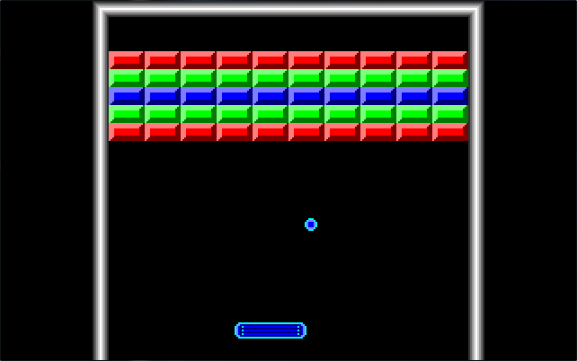

Ricochet
========

A Breakout-like game for MS-DOS and MikeOS

## Building Ricochet
This project requires FASM 1.x (http://flatassembler.net).

To assemble, run `fasm ricochet.asm -d _target=[target]`

<b>Valid values for `[target]`:</b>
- `target.dos` -- build a COM executable for a MS-DOS compatible environment (.com)
- `target.mikeos` -- build a MikeOS executable (.bin)

For more information on the MikeOS project, see http://mikeos.sourceforge.net

## Screenshots

